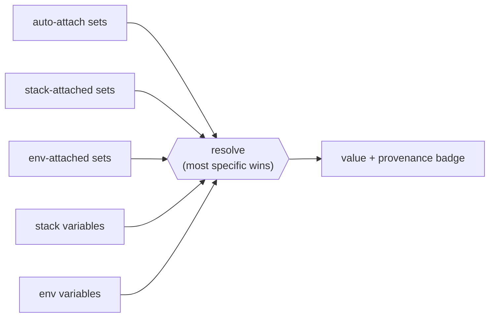
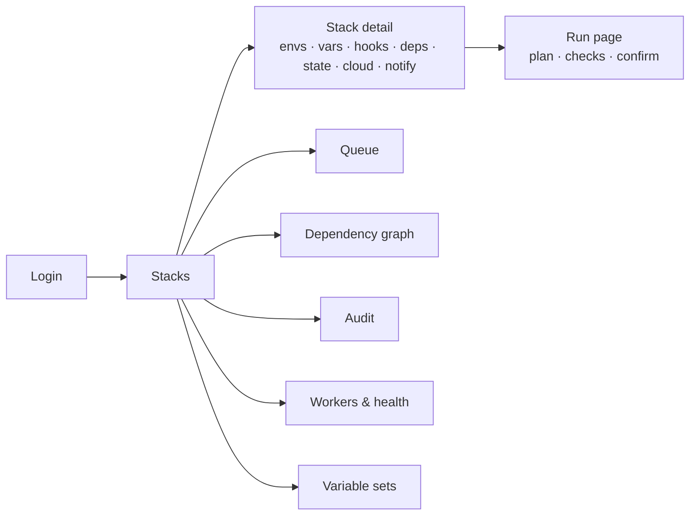
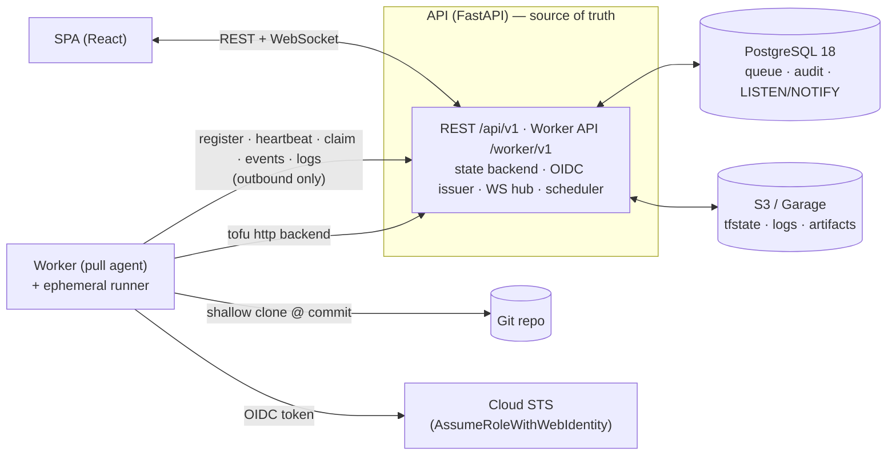
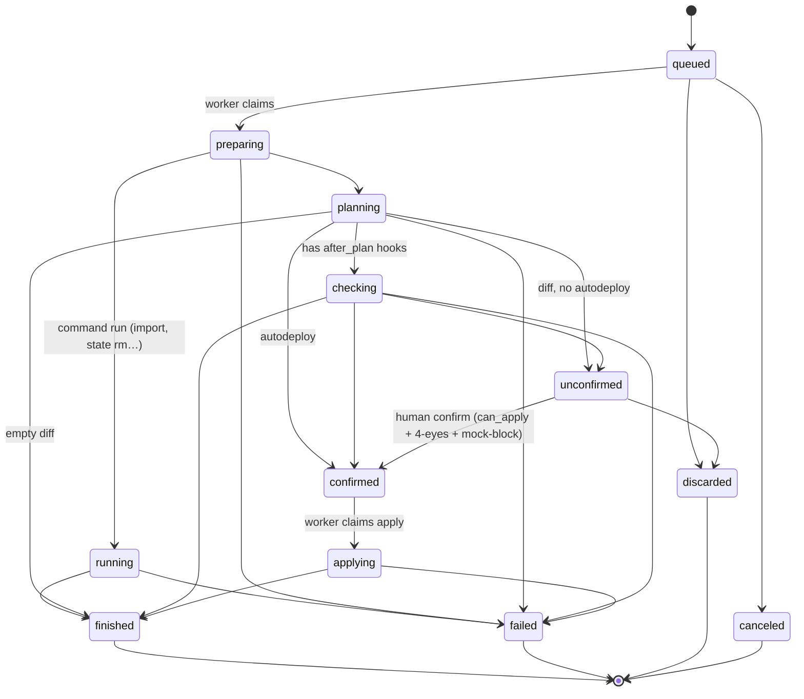
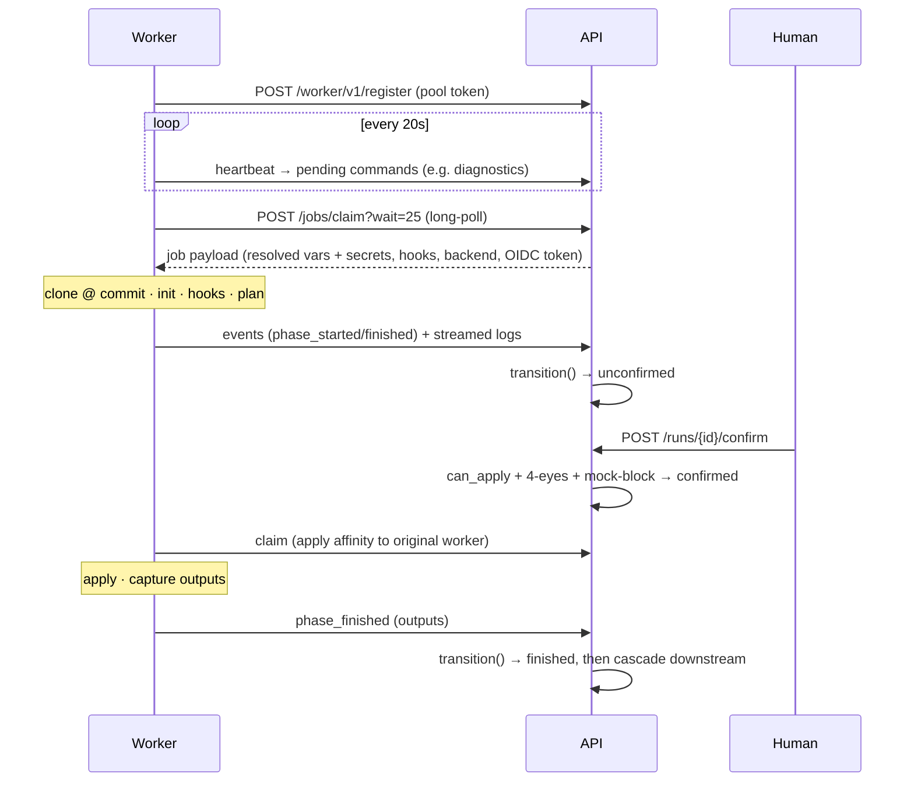
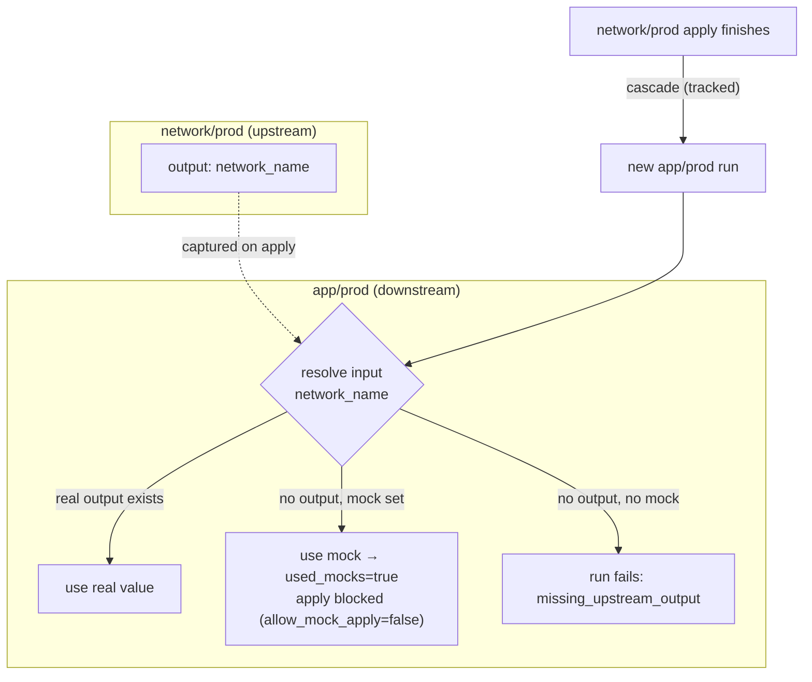
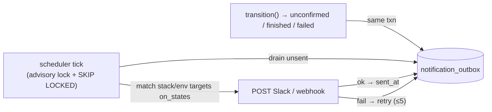

<div align="center">


### Ship infrastructure changes with confidence.

**A self-hostable control plane for Terraform & OpenTofu** — every change becomes a reviewable
`plan → 👀 human approval → apply`, run on disposable workers, with a full audit trail and
short-lived cloud credentials minted per run. 🔐

[](https://github.com/fmiquel90/stackd/actions/workflows/ci.yml)
[](https://github.com/fmiquel90/stackd/actions/workflows/e2e.yml)


📖 **[Read the documentation →](https://fmiquel90.github.io/stackd/)**

</div>

> **No static cloud secrets. No shared state. No one running `apply` from their laptop.**

---

## 🤔 Why Stackd?

Running Terraform by hand doesn't scale: secrets live in CI variables, `apply` happens on someone's
machine, the state file is a shared landmine, and "who changed prod?" has no good answer. Managed
SaaS solves it — but you hand over your state, your credentials, and your audit log.

**Stackd is the self-hosted middle ground.** The API is the single source of truth; workers are
stateless and disposable; every state change is one auditable event; cloud credentials are minted
per run and expire with it. You keep everything, on your own infrastructure.

## ✨ Features

- 🔭 **`plan → approve → apply`** — every run pauses for a human, with the diff, checks and inputs in front of them.
- 🤖 **Pull-based workers** — agents poll for work; **no inbound ports**, nothing to expose. Scale by adding more.
- 🔐 **Per-run OIDC credentials** — workers assume a cloud role via a short-lived token. No static keys anywhere.
- 🧬 **Cross-environment dependencies** — wire one env's outputs into another, with **mocks** to bootstrap a fresh cascade.
- 🛡️ **Tiers & four-eyes** — `dev < staging < prod`; prod applies require a *second* person.
- 🗂️ **Layered variables** — sets → stack → env, with a **provenance badge** showing where each value came from.
- 🔑 **External secret sources** — reference a value in a secrets manager (Proton Pass) instead of storing it; fetched live, with a fallback when the source is down ([guide](https://fmiquel90.github.io/stackd/guide/external-secrets/)).
- 📜 **Full audit trail** — every mutation writes an append-only event *in the same transaction*.
- 🔔 **Notifications** — Slack/webhook on "awaiting approval", "finished", "failed" — close the loop without watching the UI.
- 📡 **Live updates** — the run page and dependency graph light up in real time over WebSocket.
- 🧰 **Ad-hoc commands** — run allowlisted subcommands (import, state rm/mv, taint…) as audited runs, gated like apply.
- ⬆️ **Promotion** — deploy the *exact* commit running on one env to the next (trunk-based dev→staging→prod), gated like apply.
- 🔓 **Low lock-in** — code stays in Git, state is plain `tfstate`, IAM is standard; leaving is a reversible `tofu init -migrate-state` ([exit guide](https://fmiquel90.github.io/stackd/guide/leaving/)).
- 🧪 **Tested for real** — 72 tests on real Postgres + a live end-to-end scenario running actual OpenTofu.

## ⚡ Quick start

> **Prerequisites:** Docker, [Task](https://taskfile.dev), [`uv`](https://docs.astral.sh/uv/), and `pnpm` (via corepack).

```bash
task dev      # generates .env + dev keys, brings up the stack, migrates & seeds
```

Then open **<http://localhost:5173>** and hit **Dev login** as `admin` / `alice` / `bob` (three
personas with distinct tiers). No Google account or AWS needed. 🎉

```bash
task test     # unit + integration (real Postgres via testcontainers)
task e2e      # the full live scenario, real worker running OpenTofu
task reset    # tear everything down and start fresh
task psql · task logs · task lint
```

## 🖼️ What it looks like

The signature screen is the **Run page** — dark, dense, terminal-flavoured. The phase rail tracks
progress; the centre shows the plan diff, the checks (tfsec / infracost / policy), the resolved
inputs **with provenance**, and the live log; the action bar gates the apply:

```text
┌ core-network / prod / run #142 ─────────────────────────────── [ unconfirmed ] ┐
│ PHASES             │ PLAN   +3 ~1 -0                                            │
│ ● Preparing   12s  │   + aws_vpc.main                                           │
│ ● Planning     8s  │   ~ aws_subnet.app          (tier change)                 │
│ ◐ Checking         │   - aws_eip.legacy                                         │
│ ○ Apply            │ CHECKS  tfsec ✔   infracost ✔ +$12.40/mo   policy ⚠ warn  │
│                    │ INPUTS  region        = eu-west-1            [set:common]  │
│                    │         network_name  = core-net-prod       [dependency]  │
│                    │         db_password   = ••••••••            [env · secret] │
│                    │ LOGS  ▎ OpenTofu will perform the following actions…       │
├────────────────────┴─────────────────────────────────────────────────────────┤
│  ⚠ prod · second approval required      [ Discard ]     [ Confirm & apply ▸ ]  │
└────────────────────────────────────────────────────────────────────────────────┘
```

**Variables resolve in layers, with provenance** — the most specific layer wins, and the UI shows
*where* each value came from:



**The whole app in one glance** (`docs/DESIGN.md` is the full spec):



> 💡 Want pixel screenshots? `task dev`, open <http://localhost:5173>, log in with a dev persona —
> the live UI matches the wireframe above.

## 🏗️ Architecture

> Diagrams render on GitHub. This is the 10-minute tour — `docs/SPECS.md` is the exhaustive truth,
> `docs/CONCEPTS.md` the example-driven walkthrough.

### 🧭 System

**The API is the single source of truth. Workers have no inbound ports — they only pull.** The
queue is Postgres (`SELECT … FOR UPDATE SKIP LOCKED`), there's no broker, and Terraform talks to the
API's HTTP state backend rather than to S3 directly.



### 🔄 Run state machine

Every state change goes through one function, `transition()`: it checks legality, does an atomic
guarded update, writes a `run_event` + (for human/terminal actions) an `audit_event` in the **same
transaction**, emits `LISTEN/NOTIFY`, and enqueues any notification. `checking` is skipped when
there are no `after_plan` hooks.



### 🤝 Worker pull protocol

One active run per environment (a partial unique index — the real concurrency guard); different
environments run in parallel.



### 🧬 Dependencies, mocks & cascade

At claim the API resolves each referenced input as **real upstream output › mock › explicit
error**. A run that consumed a mock is flagged `used_mocks` and can't be applied unless the env opts
in. When a tracked apply finishes, downstream environments cascade — protections are never bypassed.



### 🔔 Notifications — transactional outbox

`transition()` enqueues a row in `notification_outbox` in the same transaction (no I/O in the
request path). The scheduler drains it under an advisory lock with `FOR UPDATE SKIP LOCKED`, so a
rolled-back transition never notifies and two API replicas never double-send.



## 📈 Scaling

Workers are stateless pull agents, so **scaling out = running more of them** (e.g. bumping an ECS
service `desiredCount`). Postgres serializes claims with two guards (`FOR UPDATE … SKIP LOCKED` +
the `one_active_run_per_env` unique index). What's worth knowing:

- 🧩 **The unit of parallelism is the environment, not the worker** — one active run per env, but
  different envs run concurrently. Throughput ≈ `min(workers, envs with queued work)`.
- 🏷️ **Labels segment pools** — a worker only claims runs whose env labels are a subset of its own,
  so you can dedicate (and scale) a prod pool independently.
- ♻️ **Workers are interchangeable & disposable** — apply affinity prefers the worker that planned,
  but expires; a lost worker's run is failed (`worker_lost`) by the scheduler.
- 📊 **No built-in autoscaler**, but `/api/v1/health` and `/queue` expose the signals an external one
  (ECS target-tracking, KEDA) can drive. On Fargate, mind the runner execution model (no DinD).

## 🧪 Tests & CI

**72 automated tests** on real Postgres 18 (testcontainers) + moto — **65 API + 7 worker** — plus a
**live end-to-end scenario** (`task e2e`) that drives the full `plan → confirm → apply → cascade`
against the running stack with a real worker executing OpenTofu. Full map in
[`docs/TESTING.md`](docs/TESTING.md).

**CI** ([`.github/workflows/`](.github/workflows/)): `ci.yml` runs pre-commit + api/worker lint &
tests + the front typecheck & build on every push/PR; `e2e.yml` runs the live scenario on `main` and
on demand. Set up local hooks with `uvx pre-commit install` — ruff & ruff-format run through each
project's own `uv` env, so there's zero version drift with CI.

## 🗺️ Roadmap

**Built and green ✅**

- ✅ Auth (Google OIDC + dev login), users & roles, append-only audit
- ✅ Stacks · environments · 5-layer variable resolution with provenance
- ✅ Runs · the `transition()` state machine · pull workers · hooks
- ✅ Terraform HTTP **state backend** over S3 (lock / serial / scoped tokens)
- ✅ **Dependencies, outputs, mocks & cascade** (the differentiator)
- ✅ GitHub **webhooks** (push → tracked, PR → proposed) + staleness
- ✅ **OIDC workload credentials** (per-run role assumption, plan vs apply)
- ✅ **Notifications** (Slack/webhook outbox) · WS live updates · dependency graph · worker diagnostics

**Next 🔜** — multi-parent cascade gating · S3 cold-log archival/purge · webhook anti-replay
hardening · RBAC per space (Phase 7).

<details>
<summary>📋 Detailed phase-by-phase status</summary>

**Phase 0 (Foundations + Auth).** Monorepo, Taskfile, `docker-compose.dev.yml`. Async SQLAlchemy 2 +
Alembic, RFC 9457 errors, AES-256-GCM, UUIDv7. Access JWT + rotating refresh with **family reuse
detection**, CSRF double-submit, Google OIDC (PKCE + `hd`), dev login. Users admin, every change
audited.

**Phase 1 (Stacks + Environments + Variable sets).** 5-layer resolution with provenance
(auto-attach sets < stack-attached < env-attached < stack vars < env vars). `can_apply` tier × role
gate. Repo secret encryption + `git ls-remote`. Full audited CRUD, detach-required 409.

**Phase 2 ⭐ (Runs + Workers + Hooks).** `transition()` — the single source of state change. Run
lifecycle with `can_apply` + 4-eyes + mock block; autodeploy + warn-forces-unconfirmed. Worker
protocol: pools, register/heartbeat/claim/events/logs, claim = `FOR UPDATE OF env SKIP LOCKED` +
`23505` net, apply affinity. Worker agent: clone → hooks → init → plan/apply → report, with secret
masking and repo-hooks-without-secrets.

**Phase 3 (State backend + Audit).** Terraform HTTP backend `GET/POST/LOCK/UNLOCK` over S3, scoped
Basic-auth state JWT (RO for proposed), serial-regression 409, lock 423, force-unlock. `GET /audit`
+ CSV export.

**Phase 4 ⭐ (Dependencies + outputs + mocks + cascade).** `env_dependencies` / `output_references` /
`env_outputs`, anti-cycle DFS. Resolution **real > mock > error**; `used_mocks` blocks apply. Output
capture at finish; cascade on apply (`on_output_change` / `always` / `never`).

**Phase 5 (Webhooks + proposed runs + staleness).** `POST /webhooks/github` HMAC SHA-256,
branch→env mapping + `project_root` filter, push→tracked + `head_sha` advance, PR→proposed.

**Phase 6 (OIDC workload credentials).** Issuer `/.well-known/…` + JWKS (RS256). Workload token
signed at claim: `sub=run:<tier>:<stack>:<phase>`, plan vs apply assume different roles.
`cloud-integration` CRUD + AssumeRole test.

**Cross-cutting.** `worker_lost` scheduler under `pg_try_advisory_lock`; WS `LISTEN/NOTIFY` fan-out
hub; structured JSON logging (`/api/v1/logs`, `/api/v1/health`); first-login walkthrough; worker
diagnostics over the heartbeat command channel (no inbound to workers).

</details>

## 📚 Documentation

📖 **User docs (a real site): <https://fmiquel90.github.io/stackd/>** — a task-oriented guide built
from `docs/` with MkDocs Material (`task docs` to preview locally, deployed by `.github/workflows/docs.yml`).
The source markdown also reads fine on GitHub:

| Doc | What's in it |
|---|---|
| [`docs/CONCEPTS.md`](docs/CONCEPTS.md) | 🧠 Start here — every concept explained with worked examples |
| [`docs/PLAN.md`](docs/PLAN.md) | 🗺️ Phases, scope, what's in/out of the MVP |
| [`docs/SPECS.md`](docs/SPECS.md) | 📐 The technical source of truth (data model, state machine, API…) |
| [`docs/DESIGN.md`](docs/DESIGN.md) | 🎨 The front: tokens, components, screens |
| [`docs/DEV.md`](docs/DEV.md) | 🛠️ Local environment, Taskfile, seed, the demo scenario |
| [`docs/TESTING.md`](docs/TESTING.md) | 🧪 Test strategy + a map of every test |
| [`CLAUDE.md`](CLAUDE.md) | 🤖 Working rules & invariants — read before changing behaviour |

## 🧰 Repository layout

```
api/      FastAPI (Python 3.13, uv) — REST + worker API, auth, audit, OIDC issuer, state backend
worker/   Pull-model agent (Python)
front/    React 19 + Vite 7 + TypeScript (pnpm)
deploy/
  docker-compose.dev.yml          local dev stack
  terraform/                      production AWS deployment (see below)
    modules/  kms · network · database · storage · secrets · ecr · iam · api · worker · cdn
    examples/ minimal · production
docs/     PLAN · SPECS · DESIGN · DEV · CONCEPTS · TESTING
Taskfile.yml
```

## ☁️ Deploying to AWS

`deploy/terraform/` contains production-ready OpenTofu/Terraform for AWS. Architecture: ECS Fargate
(API + workers) · RDS PostgreSQL · S3 · internal ALB · CloudFront VPC Origin.

```bash
cd deploy/terraform/examples/minimal
cp terraform.tfvars.example terraform.tfvars
# fill in aws_region at minimum
tofu init && tofu apply
```

**Bootstrap sequence** (first deploy):

1. `tofu apply` — creates infrastructure. ECS tasks fail to start (no images yet).
2. Push images to the ECR URLs from `output.ecr_api_repository_url` / `ecr_worker_repository_url`.
3. `tofu apply -var api_image=<url>:TAG -var worker_image=<url>:TAG` — tasks start.
4. Open `output.public_url`, log in, create a worker pool, copy the token.
5. If Google OIDC: register `output.google_oauth_redirect_uri` in your Google Cloud Console app.
6. `tofu apply -var worker_pool_token=wpt_... -var google_client_id=... -var google_client_secret=...`

See [`deploy/terraform/examples/`](deploy/terraform/examples/) for full variable reference.

---

<div align="center">

**OpenTofu-first** (Terraform supported too) · **self-hostable** · **the API is the single source of truth**

</div>
