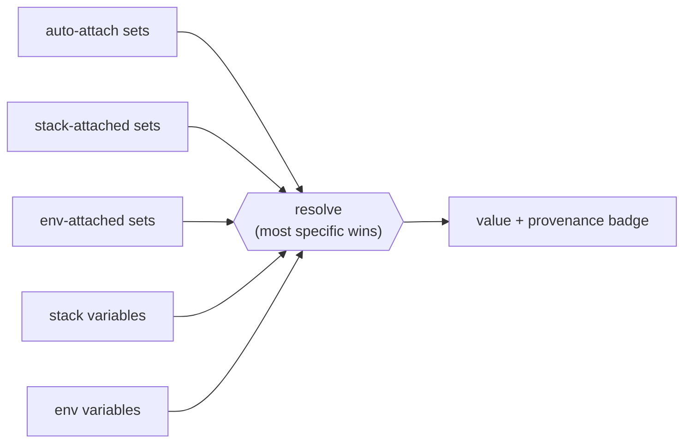
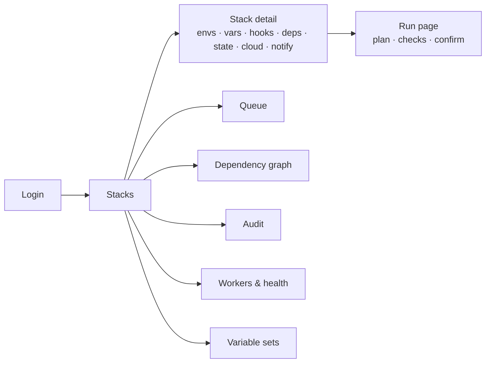
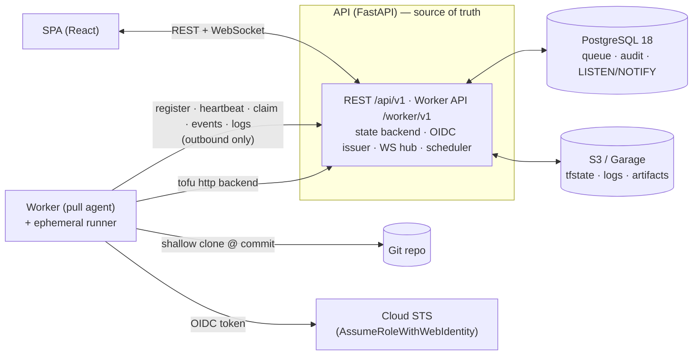
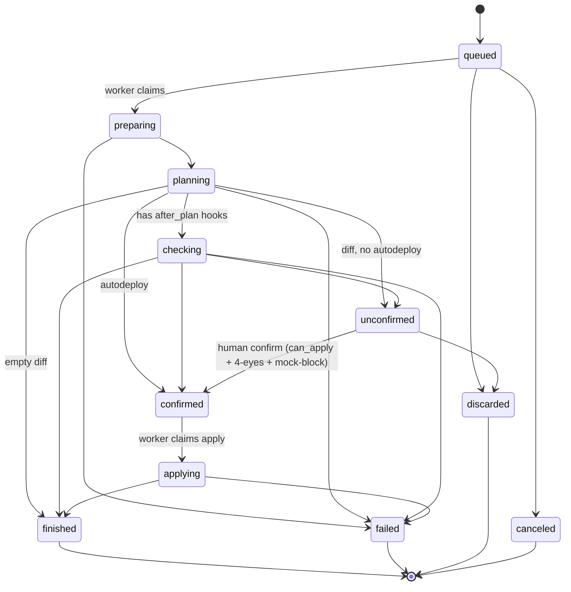
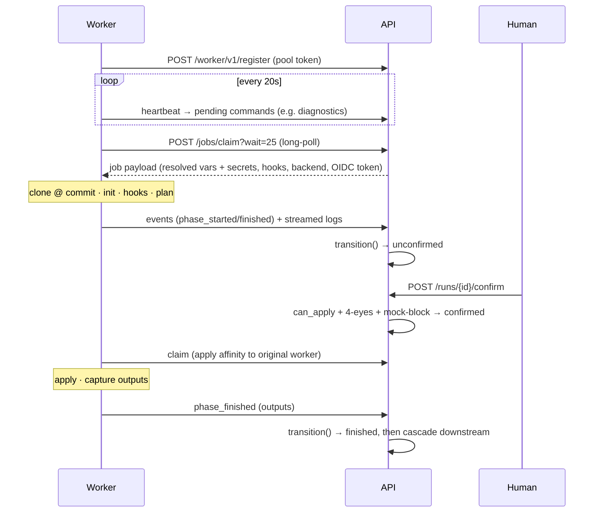
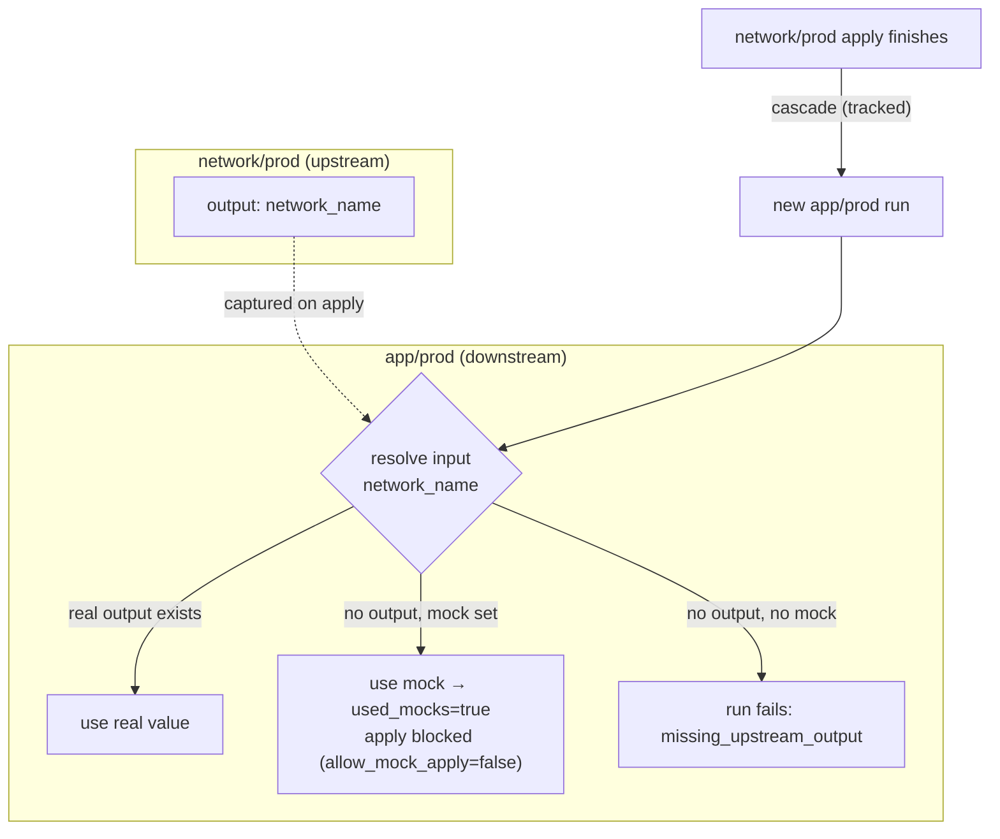
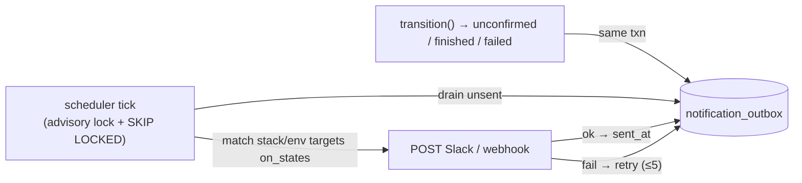

# Stackd

[](https://github.com/fmiquel90/stackd/actions/workflows/ci.yml)
[](https://github.com/fmiquel90/stackd/actions/workflows/e2e.yml)

**Ship infrastructure changes with confidence.** Stackd is a self-hostable control plane for
Terraform/OpenTofu that turns every change into a reviewable **`plan → human approval → apply`** run
— executed on disposable, pull-based workers, with a full audit trail and **short-lived cloud
credentials minted per run via OIDC**. No static secrets, no shared state, no one running `apply`
from their laptop.

Multi-environment stacks, inter-environment dependencies (with mock bootstrapping), and tier-based
approvals with four-eyes on prod. **The API is the single source of truth; workers are stateless
and disposable.**

Authoritative docs live in [`docs/`](docs/): `PLAN.md` (phases/scope), `SPECS.md` (technical
source of truth), `DESIGN.md` (front), `DEV.md` (local environment), `CONCEPTS.md` (a worked,
example-driven guide to every concept), and `TESTING.md` (the test strategy + a map of every test).
Read them before changing behavior — see `CLAUDE.md` for working rules.

## Repository layout

```
api/      FastAPI (Python 3.13, uv) — REST + worker API, auth, audit, OIDC issuer, state backend
worker/   Pull-model agent (Python)
front/    React 19 + Vite 7 + TypeScript (pnpm)
deploy/   docker-compose.dev.yml, Garage config
docs/     PLAN / SPECS / DESIGN / DEV / CONCEPTS / TESTING
Taskfile.yml
```

## Quick start (dev)

Requires Docker, [Task](https://taskfile.dev), `uv`, and `pnpm` (via corepack).

```bash
task dev      # generates .env + dev keys, brings up the stack, migrates, seeds
```

Then open http://localhost:5173 and use **Dev login** (`admin` / `alice` / `bob`, distinct
tiers — DEV §3). No Google account or AWS needed.

Useful tasks: `task test`, `task e2e`, `task reset`, `task psql`, `task logs`, `task lint`.

## What it looks like

The signature screen is the **Run page** — a dense, dark, terminal-flavoured view (DESIGN §3)
where the human makes the apply decision. The phase rail on the left tracks progress; the centre
shows the plan diff, the check results (tfsec / infracost / policy), the resolved inputs with their
**provenance**, and the live log; the action bar gates the apply:

```text
┌ core-network / prod / run #142 ─────────────────────────────── [ unconfirmed ] ┐
│ PHASES             │ PLAN   +3 ~1 -0                                            │
│ ● Preparing   12s  │   + aws_vpc.main                                           │
│ ● Planning     8s  │   ~ aws_subnet.app          (tier change)                 │
│ ◐ Checking         │   - aws_eip.legacy                                         │
│ ○ Apply            │ CHECKS  tfsec ✔   infracost ✔ +$12.40/mo   policy ⚠ warn  │
│                    │ INPUTS  region        = eu-west-1            [set:common]  │
│                    │         network_name  = core-net-prod       [dependency]  │
│                    │         db_password   = ••••••••            [env · secret] │
│                    │ LOGS  ▎ OpenTofu will perform the following actions…       │
├────────────────────┴─────────────────────────────────────────────────────────┤
│  ⚠ prod · second approval required      [ Discard ]     [ Confirm & apply ▸ ]  │
└────────────────────────────────────────────────────────────────────────────────┘
```

**Variables resolve in layers, with provenance** — the most specific layer wins, and the UI shows
*where* each value came from (a set, the stack, the env, an upstream dependency, or a mock):



**The SPA in one glance** (`DESIGN.md` is the full spec):



> Want pixel screenshots? Run `task dev`, open <http://localhost:5173>, and log in with a dev
> persona — the live UI matches the wireframe above.

## Architecture at a glance

The diagrams below render on GitHub (Mermaid). They are the 10-minute tour; `SPECS.md` is the
exhaustive truth and `CONCEPTS.md` the example-driven walkthrough.

### System

**The API is the single source of truth. Workers have no inbound ports — they only pull.** The
queue is Postgres (`SELECT … FOR UPDATE SKIP LOCKED`), there is no broker, and Terraform talks to
the API's HTTP state backend rather than to S3 directly.



### Run state machine

Every state change goes through the single `transition()` function (CLAUDE invariant #1): it checks
legality, does an atomic guarded update on `from_state`, writes a `run_event` + (for human/terminal
actions) an `audit_event` in the **same transaction**, emits `LISTEN/NOTIFY`, and enqueues any
notification. `checking` is skipped when there are no `after_plan` hooks.



### Worker pull protocol

One active run per environment (a partial unique index, enforced as the real concurrency guard);
different environments run in parallel. Scaling = more workers (see [Scaling](#scaling)).



### Dependencies, mocks & cascade

At claim the API resolves each referenced input as **real upstream output > mock > explicit
error**. A run that consumed a mock is flagged `used_mocks` and cannot be applied unless the env
opts in. When a tracked apply finishes, downstream environments are cascaded (protections are never
bypassed — a protected downstream still stops at `unconfirmed`).



### Notifications — transactional outbox

`transition()` enqueues a row in `notification_outbox` in the same transaction (no I/O in the
request path). The scheduler drains it under an advisory lock with `FOR UPDATE SKIP LOCKED`, so a
rolled-back transition never notifies and two API replicas never double-send.



## Implementation status

**Phase 0 (Foundations + Auth) — done.**

- Monorepo, Taskfile, `docker-compose.dev.yml` (Postgres 18, Garage, API, worker, front).
- API: settings, async SQLAlchemy 2 + Alembic, RFC 9457 errors, AES-256-GCM, UUIDv7 PKs.
- Models: `spaces`, `users`, `refresh_tokens`, `audit_events` (DB-level append-only trigger).
- Auth: access JWT (15 min) + rotating refresh (14 d) with **family reuse detection**,
  CSRF double-submit on `/refresh` + `/logout`, Google OIDC (PKCE + `hd` restriction + bootstrap
  admin), dev login (3 personas, removed from the prod build).
- Users admin (`role` / `max_apply_tier` / `can_destroy` / `disabled`), every change audited.
- Front: design tokens (dark + light), app shell (nav rail + breadcrumb), login, and the
  signature identity components (`PhaseRail`, `StateBadge`, `ProvenanceBadge`).
- Tests: pytest on real Postgres 18 (testcontainers) — auth flow, reuse detection, role guards,
  same-transaction audit.

**Phase 1 (Stacks + Environments + Variable sets) — done.**

- Models: `stacks`, `environments`, `variables`, `variable_sets`, `variable_set_attachments`
  (migration 0002) with CHECK constraints + partial unique indexes (§3.3).
- **5-layer variable resolution** with provenance: auto-attach sets < stack-attached sets <
  env-attached sets < stack vars < env vars (§3.4). Sensitive values AES-GCM encrypted, write-only.
- `can_apply(user, env)` tier × role gate (§2.4). Repo secret encryption + `git ls-remote`
  check-repo / refresh-head.
- REST: full CRUD for stacks, environments, variables (stack/env/set), variable sets,
  attachments, `/resolved-variables` — every mutation audited (§6.2). Detach-required 409.
- Front: stacks table + create, stack detail (environments + resolved variables with
  `ProvenanceBadge`), Variable Sets page.
- Tests: 5-layer resolution + provenance, `can_apply` matrix, sensitive write-only, detach 409,
  protected→no-autodeploy. Validated end-to-end over HTTP (env override wins, set value inherited,
  secret masked).

**Phase 2 ⭐ (Runs + Workers + Hooks) — backend core + agent done.**

- Models: `runs`, `run_events`, `worker_pools`, `workers`, `hooks`, `run_logs` (migration 0003) +
  the `one_active_run_per_env` partial unique index (§3.5).
- **`transition()`** — the single source of state change (invariant #1): legality table, atomic
  guarded update on `from_state`, `run_event` + audit (same txn), `LISTEN/NOTIFY` signal (§4.2).
- Run lifecycle: trigger / confirm / discard / cancel with `can_apply` + 4-eyes + mock block (§2.4,
  §9.3). Autodeploy auto-confirm; a `warn` check forces `unconfirmed`.
- Worker protocol (§7): pools (admin, token hashed), register/heartbeat/claim/events/logs/artifacts.
  **Claim** = `FOR UPDATE OF env SKIP LOCKED` + `23505` net (§7.2), apply affinity, claim payload
  (variable resolution with secrets revealed + provenance snapshot, hooks merge, masking table).
- Worker **agent** (Python, local runner): claim → clone → hooks → init → plan/apply → report,
  with per-value secret masking and repo-hooks-without-secrets (§8.3).
- Tests: full lifecycle via simulated worker, **concurrency (one wins, 23505 net)**, confirm guards
  (tier / 4-eyes / mock), autodeploy + warn-forces-unconfirmed, illegal transition; agent masking.

**Phase 3 (State backend + Audit) — done.**

- `state_versions` / `state_locks` (migration 0004); Terraform HTTP backend `GET/POST/LOCK/UNLOCK`
  over S3 (boto3) with scoped Basic-auth state JWT (RO for proposed), serial-regression 409,
  lock 423, force-unlock (audited). Agent injects the http backend via `-backend-config`.
- `GET /audit` (filters) + CSV export (admin). Tests: lock/serial/RO scope (moto S3), audit filter.

**Phase 4 ⭐ (Dependencies + outputs + mocks + cascade) — done.**

- `env_dependencies` / `output_references` (with `mock_value`) / `env_outputs` (migration 0005),
  anti-cycle DFS. Resolution at claim: **real value > mock > explicit error**; `used_mocks` blocks
  apply; `dependency.mock_consumed` audited. Output capture at finish; cascade to downstream on
  apply (topo by edge, `on_output_change`/`always`/`never`), protections never bypassed.
- Endpoints: dependencies CRUD, `link-by-name`, `/outputs`, `/graph`, `with_downstream` groups.
- Tests: mock-used+blocks-apply, real-beats-mock, missing-upstream→failed, anti-cycle, cascade.

**Phase 5 (Webhooks + proposed runs + staleness) — done.**

- `POST /webhooks/github` HMAC SHA-256 verify (per-repo secret), branch→env mapping +
  `project_root` filter, push→tracked + `head_sha` advance, PR→proposed (plan-only).
- Tests: HMAC verify + head update + trigger, invalid-sig 401, PR→proposed.

**Phase 6 (OIDC workload credentials) — done.**

- `oidc_signing_keys` / `cloud_integrations` (migration 0006). Issuer `/.well-known/...` + `/oidc/jwks`
  (RS256, lazily-created key). Workload token signed at claim: `sub=run:<tier>:<stack>:<phase>`,
  plan vs apply assume different roles. `cloud-integration` CRUD + AssumeRole test (moto STS).
  Agent exports `AWS_WEB_IDENTITY_TOKEN_FILE`/`AWS_ROLE_ARN` to terraform only (not repo hooks, §8.3).
- Tests: issuer/JWKS, signed token claims + JWKS verify, plan-vs-apply role, AssumeRole (moto).

**Cross-cutting — done.** `worker_lost` scheduler under `pg_try_advisory_lock` (§7.5); WS
`/api/v1/ws` LISTEN/NOTIFY fan-out hub (§5.3). Structured JSON logging (ring buffer + `/api/v1/logs`,
`/api/v1/health`). First-login walkthrough (server-persisted). **Worker diagnostics**: an admin
button queues a read-only bundle (versions, disk, env var *names*, recent agent logs — no secret
values) delivered via the heartbeat command channel (no inbound to workers).

**Front — functional across phases.** Stacks table + wizard, stack detail (envs + resolved vars +
Plan trigger + hooks/deps/state/cloud/notifications tabs), run page (PhaseRail timeline + plan
summary + checks + inputs/provenance + logs + confirm/discard, WS-live with poll fallback),
`/queue` (blocking reasons), `/audit` (filter), `/graph` (react-flow + accessible list), Variable Sets.

## Scaling

Workers are stateless pull agents; **scaling out = running more of them** (e.g. raising an ECS
service `desiredCount`). No central dispatcher — each worker long-polls `claim`, and Postgres
serializes them with two guards (`FOR UPDATE … SKIP LOCKED` + the `one_active_run_per_env` unique
index, caught as `23505`). Key properties:

- **The unit of parallelism is the environment, not the worker.** At most one active run per env;
  different envs run concurrently. So throughput ≈ `min(workers, envs with queued work)` — adding
  workers beyond the number of active environments doesn't help.
- **Labels segment pools.** A worker only claims a run whose env labels are a subset of its own
  (`e.labels <@ worker.labels`), so you can dedicate a prod pool and scale pools independently.
- **Workers are interchangeable & disposable.** Apply affinity prefers the worker that planned (for
  a warm workspace) but expires; a lost worker's run is failed (`worker_lost`) by the scheduler.
- **No autoscaler is built in**, but `/api/v1/health` (queue depth, workers online) and `/queue`
  expose the signals an external one (ECS target-tracking, KEDA) can drive. On Fargate, decide how
  the per-command runner container executes (no Docker-in-Docker) — see `SPECS §7`.

### Test coverage

59 automated tests on real Postgres 18 (testcontainers) + moto: **54 API + 5 worker**, green —
plus a **live end-to-end scenario** (`task e2e`, `api/e2e/`) that drives the full
plan → confirm → apply → cascade against the running stack with a real worker executing OpenTofu.
See `docs/TESTING.md` for the full map.

**CI & hooks.** GitHub Actions (`.github/workflows/`): `ci.yml` runs pre-commit, the api lint +
format + tests, the worker lint + format + tests, and the front typecheck + build on every push/PR;
`e2e.yml` runs the live scenario on `main` and on demand. `mypy` is wired but advisory (the codebase
isn't strict-clean yet). Local hooks: `uvx pre-commit install` then `uvx pre-commit run --all-files`
— ruff/ruff-format run through each project's own `uv` env (zero version drift with CI).

### Known follow-ups

- (Done: **live `task e2e`** (DEV §7) — the seed provisions a worker-pool token (written to the
  shared `.dev` mount) + `file://` fixture repos using only the built-in `terraform_data` resource
  (offline, no providers); the real agent runs OpenTofu end-to-end (plan → confirm → apply → cascade
  with a mock-bootstrapped downstream). **Outbound notifications** — a transactional outbox enqueued
  in `transition()`, drained by the scheduler under an advisory lock; Slack/webhook targets scoped to
  a stack or env, firing on `unconfirmed`/`finished`/`failed` — closes the human approval loop.)
- (Done: dependency graph visual —
  react-flow + dagre, mock edges dashed violet; **run-group live node coloring** — the graph
  subscribes to every `environment:<id>` channel over a single WebSocket, so a cascade lights up
  every node the moment each transition fires (the 30s poll is only a reconnection fallback);
  hooks, dependencies, **State** (versions +
  force-unlock) and **Cloud-integration** (OIDC config + AssumeRole test) editors as env tabs;
  **WS live** updates on the run page via `LISTEN/NOTIFY` (slow poll fallback, with an integration
  test); **prod/destroy confirm friction** — type the env name + plan recap, §5.2; **Ladle** stories
  for the identity components — PhaseRail, StateBadge, ProvenanceBadge — the DESIGN §8 visual contract.)

Run the visual contract: `cd front && pnpm ladle` (or `pnpm ladle:build`).
- Multi-parent cascade gating; S3 cold log storage + archival/purge tasks;
  webhook anti-replay hardening (§13, Phase 7).
