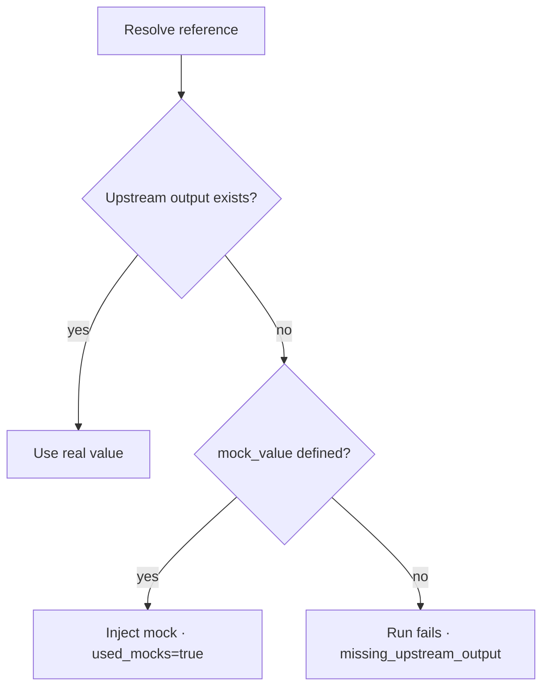

# Dependencies, outputs & mocks

Environments can depend on each other and pass **outputs** as inputs. An upstream
environment (e.g. `network/dev`) produces outputs; a downstream environment (e.g.
`app/dev`) consumes them as variables. This is what lets Stackd wire a whole stack
together and run it as a **cascade** — and what mocks let you bootstrap before the
first apply ever happens.

## Declare a dependency

A dependency is an edge `upstream env → downstream env` plus a list of
`output_references`. Each reference maps an upstream `output_name` (a Terraform
output) to a downstream `input_name` (a variable, without the `TF_VAR_` prefix), with
an optional `mock_value`.

```bash
curl -s -X POST localhost:8000/api/v1/environments/$APP_DEV/dependencies \
  -H "Authorization: Bearer $TOKEN" -H 'content-type: application/json' -d '{
    "upstream_env_id": "'"$NETWORK_DEV"'",
    "trigger_policy": "on_output_change",
    "references": [
      { "output_name": "network_name", "input_name": "network_name", "mock_value": "mock-network" }
    ]
  }'
```

Cycles are rejected at creation (`422`). The only structural constraint is
`upstream <> downstream` — two environments **of the same stack** may depend on each
other (primary/secondary region pattern). To wire same-named environments across two
stacks in bulk, use the helper:

```bash
curl -s -X POST localhost:8000/api/v1/stacks/$STACK_ID/dependencies/link-by-name \
  -H "Authorization: Bearer $TOKEN"
```

## How inputs resolve

Inputs are resolved fresh **at claim time** and snapshotted into `resolved_inputs`.
The rule is **real upstream output > mock > explicit error**.



A `sensitive` upstream output is **never stored nor propagated**: a reference pointing
at one is a visible config error, never a silent null.

## Mocks & the apply block

Mocks solve the chicken-and-egg of bootstrapping a cascade: you can plan `app/dev`
with `network_name = "mock-network"` *before* `network/dev` has ever applied, just to
validate config. A run that injected a mock is flagged `used_mocks=true`, audited as
`dependency.mock_consumed`, and wears a violet `MOCKED` badge in the UI.

!!! warning "A mocked run cannot be applied"
    `unconfirmed → confirmed` is **refused** when `used_mocks=true` and the environment
    keeps the default `allow_mock_apply=false`. A mocked plan is for validation, not for
    real changes. Set `allow_mock_apply=true` on the environment to override. Mocked runs
    are never autodeployed; PR (`proposed`) runs use mocks freely since they are plan-only.

## Cascade

On a tracked apply finishing (`applying → finished`), Stackd parses `outputs.json` and
upserts non-sensitive outputs into `env_outputs` (each with a `value_hash`). It then
walks the outgoing edges and triggers downstream runs (`type=tracked`,
`triggered_by=dependency`, sharing a `run_group_id`):

| `trigger_policy` | behavior |
|---|---|
| `never` | downstream is never auto-triggered |
| `always` | downstream triggered on every finished upstream apply |
| `on_output_change` | triggered only if the resolved `value_hash` differs from the downstream's last run |

A downstream with multiple parents fires only when **all** its run-group parents have
finished; a failed parent stops that branch (`run_group = partial_failure`).

!!! warning "Protections are never bypassed"
    The cascade never auto-confirms. A **protected** downstream still stops at
    `unconfirmed` and waits for a human — see [Runs & approvals](runs-and-approvals.md).

Launch a whole subgraph at once with `with_downstream=true`; the root starts and
subsequent levels follow via cascade:

```bash
curl -s -X POST "localhost:8000/api/v1/environments/$NETWORK_DEV/runs?with_downstream=true" \
  -H "Authorization: Bearer $TOKEN"
```

## Inspect

```bash
curl -s localhost:8000/api/v1/environments/$APP_DEV/outputs   -H "Authorization: Bearer $TOKEN"
curl -s localhost:8000/api/v1/graph                            -H "Authorization: Bearer $TOKEN"
curl -s localhost:8000/api/v1/run-groups/$GROUP_ID             -H "Authorization: Bearer $TOKEN"
```

To remove an edge: `DELETE /api/v1/dependencies/{id}`.

## See also

- [Runs & approvals](runs-and-approvals.md)
- [Concepts](../CONCEPTS.md)
- [SPECS §9](../SPECS.md)
