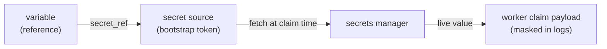

# External secret sources

A sensitive variable can carry its value **by reference** to an external secrets manager instead of storing the value in Stackd. At run time the platform resolves the reference to a live value, injects it like any other sensitive variable, and **never persists it**.

This is a security upgrade over a stored secret: no secret at rest in Stackd's database, automatic rotation (you rotate in the manager, not here), and a single revocable bootstrap credential per source.

!!! info "Provider support"
    **Proton Pass** is the first provider, via its [CLI](https://proton.me/blog/proton-pass-cli) and scoped Personal Access / AI Access Tokens. The model is provider-agnostic — Vault, AWS Secrets Manager, 1Password and others plug into the same interface.

## How it fits together



Resolution precedence per reference mirrors the rule for dependency mocks — **real value > fallback > error**:

1. **Provider reachable** → the live value is used. Provenance `secret:<source>`.
2. **Provider unreachable** → the configured [fallback](#fallback-when-the-source-is-down) applies, or the run fails closed.

The fetched value flows into the run exactly like a stored sensitive variable: it lands in the worker's `tfvars`/`sensitive_env` and the agent masks it in all logs.

## 1. Create a secret source

A secret source is **scoped to a space** and holds the machine credential used to fetch secrets. The credential is AES-256-GCM encrypted at rest and **write-only** — it is never returned by the API. Creating one requires the **admin** role.

```bash
SRC=$(curl -s -X POST localhost:8000/api/v1/spaces/$SPACE/secret-sources \
  -H "Authorization: Bearer $TOKEN" -H 'content-type: application/json' \
  -d '{
        "name": "proton",
        "provider": "proton_pass",
        "bootstrap_secret": "<proton personal access token>"
      }' | jq -r .id)
```

In the UI: **Stack → Secret sources → Manage secret sources**.

## 2. Reference it from a variable

Point a variable at the source with a provider-specific locator. For Proton Pass that is a `pass://vault/item/field` URI. A referenced variable is implicitly **sensitive**.

```bash
curl -s -X POST localhost:8000/api/v1/environments/$ENV/variables \
  -H "Authorization: Bearer $TOKEN" -H 'content-type: application/json' \
  -d '{
        "kind": "terraform",
        "name": "db_password",
        "secret_source_id": "'"$SRC"'",
        "secret_ref": "pass://infra/prod-db/password"
      }'
```

The resolved value shows up in `GET /environments/{id}/resolved-variables` with provenance `secret:proton` (and masked, since it is sensitive).

## Fallback when the source is down

Each reference has a `secret_fallback_mode` that decides what happens if the provider is unreachable at run time:

| Mode | Behaviour when the source is down |
|---|---|
| `error` *(default)* | The run **fails closed** (`secret_unavailable`). Nothing is shipped. |
| `static` | A pre-stored, operator-chosen value is used. |
| `break_glass` | A value supplied inline at trigger time is used (see below). |

### Static fallback

Store a value of your choice alongside the reference; it is used automatically only when the provider fails:

```bash
curl -s -X POST localhost:8000/api/v1/environments/$ENV/variables \
  -H "Authorization: Bearer $TOKEN" -H 'content-type: application/json' \
  -d '{
        "kind": "terraform",
        "name": "db_password",
        "secret_source_id": "'"$SRC"'",
        "secret_ref": "pass://infra/prod-db/password",
        "secret_fallback_mode": "static",
        "secret_fallback": "last-known-good-value"
      }'
```

### Break-glass override

For a `break_glass` reference, an operator supplies the value **inline at trigger time**. It is used only for that run, sealed AES-GCM, and never stored as a variable. Because it bypasses the real secret, it requires **apply permission**:

```bash
curl -s -X POST localhost:8000/api/v1/environments/$ENV/runs \
  -H "Authorization: Bearer $TOKEN" -H 'content-type: application/json' \
  -d '{ "secret_overrides": { "db_password": "manual-value" } }'
```

## Fallback blocks apply by default

A fallback value is **not the real secret** — it may be stale or operator-chosen. So a run that resolved any reference via fallback is flagged `used_secret_fallback` and **cannot be applied** unless the environment opts in:

```bash
curl -s -X PATCH localhost:8000/api/v1/environments/$ENV \
  -H "Authorization: Bearer $TOKEN" -H 'content-type: application/json' \
  -d '{ "allow_fallback_apply": true }'
```

This mirrors the mock apply-gate (`allow_mock_apply`). The plan is always allowed; only the apply is gated. In the UI the run carries a **Fallback** badge and the variable shows a `FALLBACK:` / `OVERRIDE:` provenance.

!!! warning
    Leave `allow_fallback_apply` off on production environments. A fallback is a break-glass affordance for an outage, not a normal path — keeping it off forces a deliberate, audited opt-in before a non-live secret ever reaches prod.

## Audit

Source management and every fallback event are audited (`secret_source.created`, `secret_source.token_rotated`, `secret.fallback_used`, `secret.fallback_overridden`, `secret.unavailable`). The secret value itself is never written to the audit context. Successful live resolutions are not audited individually — the run's `variable_provenance` records `secret:<source>` per variable.

## See also

- [Variables & secrets](variables.md)
- [Cloud credentials (OIDC)](cloud-credentials.md) — the same idea for cloud auth
- [SPECS](../SPECS.md) §15
