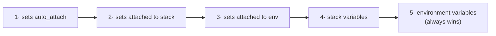

# Variables & secrets

Stackd composes the configuration of every run from layers. The same variable name can be defined in several places; the most specific layer wins, and every resolved value carries its **provenance** so you can see where it came from.

## The two kinds

Each variable has a `kind` that decides how the worker injects it:

| Kind | Injection |
|---|---|
| `terraform` | exposed as `TF_VAR_<name>` (and written to a tfvars file) |
| `environment` | exposed as a plain process environment variable for the run |

## Where a variable can live

- **Stack variable** — common to all environments of a stack (`environment_id` is null).
- **Environment variable** — scoped to a single environment.
- **Variable set** — a named, reusable bundle (e.g. `common-aws`, `datadog`, `region-eu`) you attach to many stacks or envs. Set members are never scoped to an env directly; the *attachment* carries the targeting.

## Resolution order (5 layers)

At claim time the value of each variable is resolved from weakest to strongest. The strongest layer that defines a given `(name, kind)` wins.



| Layer | Source | Ordered by |
|---|---|---|
| 1 | variable sets with `auto_attach` | increasing `priority` |
| 2 | variable sets attached to the stack | increasing `priority` |
| 3 | variable sets attached to the env | increasing `priority` |
| 4 | stack variables | — |
| 5 | environment variables | — (always wins) |

Within a layer, sets are ordered by their attachment `priority`. Two more sources are merged in at claim time but sit outside this order: upstream outputs (`dependency:`) and mocks (`mock`) — see [Concepts](../CONCEPTS.md) and [SPECS](../SPECS.md) §9.

## Inspecting resolved values

`GET /environments/{id}/resolved-variables` returns the fully resolved set, each entry tagged with its `injected_name` and `provenance`:

```bash
curl -s localhost:8000/api/v1/environments/$ENV/resolved-variables \
  -H "Authorization: Bearer $TOKEN" | jq
```

```json
[
  { "name": "region", "injected_name": "TF_VAR_region", "value": "us-east-1", "provenance": "set:region-us" },
  { "name": "cidr",   "injected_name": "TF_VAR_cidr",   "value": "10.9.0.0/16", "provenance": "env" }
]
```

The provenance snapshot is frozen onto the run (`variable_provenance`) for audit, and the UI uses it to show "inherited from `common-aws`", "overridden here" or `MOCK`.

## Variable sets

Create a set, add members, then attach it. `auto_attach: true` attaches it to every stack in the space; otherwise attach explicitly with a `priority`.

```bash
SET=$(curl -s -X POST localhost:8000/api/v1/variable-sets \
  -H "Authorization: Bearer $TOKEN" -H 'content-type: application/json' \
  -d '{"name":"common-aws","auto_attach":true}' | jq -r .id)

curl -s -X POST localhost:8000/api/v1/variable-sets/$SET/attachments \
  -H "Authorization: Bearer $TOKEN" -H 'content-type: application/json' \
  -d '{"target_kind":"environment","target_id":"'"$ENV"'","priority":10}'
```

!!! note
    Detach a set before deleting it. Deleting an attached set returns **409** with the list of attachments — explicit detachment is required.

## Sensitive values

Mark a variable `sensitive: true` to make it write-only:

```bash
curl -s -X POST localhost:8000/api/v1/stacks/$STACK/variables \
  -H "Authorization: Bearer $TOKEN" -H 'content-type: application/json' \
  -d '{"kind":"environment","name":"DD_API_KEY","value":"super-secret","sensitive":true}'
```

The value is **AES-256-GCM encrypted at rest**, decrypted only to build the worker claim payload, and the agent masks the literal value in logs.

!!! warning
    A sensitive value is **never returned in clear**. A later `GET` shows `"value": "•••"`; the plaintext is not readable again through the API.

## See also

- [Stacks & environments](stacks-and-environments.md)
- [Concepts](../CONCEPTS.md)
- [SPECS](../SPECS.md) §3.4
