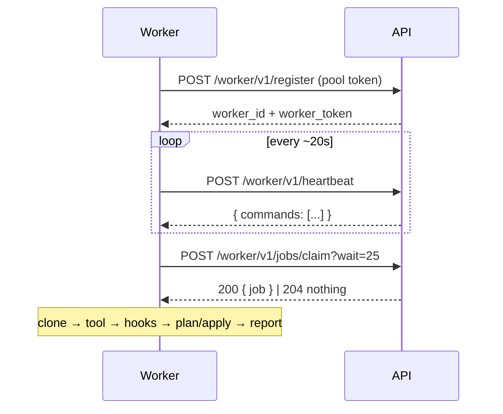

# Workers & scaling

Workers are the agents that actually run Terraform/OpenTofu. They are **self-hosted, stateless and disposable**: they **pull** work from the API and run each job in an ephemeral workspace. The API is the single source of truth; workers hold no durable state and can be killed and replaced at any time.

This page covers how the pull model works, how to run workers, and how to scale them.

## The pull model

A worker has **no inbound ports**. The API never connects out to it. Instead the worker drives everything:

1. **Register** to a pool with the pool token → it gets a `worker_id` and a per-worker token. The token expires (default 24h); the worker re-registers automatically on a `401` to refresh it.
2. **Heartbeat** every ~20s. The heartbeat response is the only *downward* channel (e.g. diagnostics, and later `cancel_job`).
3. **Claim** a job via long-poll (`POST /worker/v1/jobs/claim?wait=25`), returning `204` when there is nothing to do.
4. **Run** the job: clone the repo, set up the tool (checksum-verified), run hooks + `init`/`plan`/`apply`, stream logs, report results and upload artifacts.
5. Clean up the workspace and repeat.



The **queue is Postgres**, not a broker. A claim is an atomic `SELECT … FOR UPDATE … SKIP LOCKED` that picks the next eligible run. There is no Redis, no RabbitMQ, nothing to operate beyond the database.

### One active run per environment

`SKIP LOCKED` alone does not serialise two workers claiming two *distinct* queued runs of the **same** environment. The hard guarantee is the partial unique index `one_active_run_per_env`: the second claim violates it (SQLSTATE `23505`), is caught, and is treated as "nothing to claim" — that worker simply re-polls. The claim also locks the environment row (`FOR UPDATE OF environment`) so losers skip it and pick other work instead of wasting effort.

The practical consequence: **the unit of parallelism is the environment.** Two environments of the same stack run in parallel; two runs on the same environment never do.

### Apply affinity

After a plan, the originating worker is **preferred** for the matching apply for ~60s — it still has the workspace, so the apply reuses it. Past that delay (a dead or saturated worker), any compatible worker takes the run and does an **automatic re-plan** before applying.

### Worker loss

A worker silent for > 60s is marked `offline`. An active run on a worker offline for > 120s is transitioned to `failed (worker_lost)` by the scheduler's periodic detection task. No human action required.

An **`applying` run is the exception**: it is reclaimed only after the apply budget plus a grace period (`stackd_apply_timeout_seconds` + `stackd_apply_lost_grace_seconds`, default 15 min + 5 min). This keeps a healthy long apply from being failed mid-flight, and — since the worker hard-kills its own `apply` at the budget and its cloud/state tokens are scoped to budget + grace — guarantees a reclaimed env can't be applied by two workers at once.

## Create a pool

Workers register to a **pool**, scoped to a space. The pool token is shown once at creation and stored **hashed** — rotate it if leaked.

```bash
AUTH="Authorization: Bearer $TOKEN"
POOL_TOKEN=$(curl -s -X POST localhost:8000/api/v1/worker-pools \
  -H "$AUTH" -H "Content-Type: application/json" \
  -d '{"name": "default"}' | jq -r .token)
```

## Run a worker

A worker needs only the API URL and the pool token:

```bash
STACKD_API_URL=http://localhost:8000 \
STACKD_POOL_TOKEN=$POOL_TOKEN \
  python -m agent.main
```

In dev the runner executes commands locally. In prod the **container runner** runs each terraform and hook command inside `stackd/runner:<tool>-<version>` (bundling tfsec, checkov, infracost, jq).

!!! warning "Fargate runner caveat"
    The container runner needs to launch containers, i.e. Docker-in-Docker. **AWS Fargate does not allow this.** On Fargate, run the worker with the **local** runner, or use an ECS launch type / host that provides a Docker daemon.

## Dedicate a pool with labels

Labels route work to pools. A run is eligible for a worker only when `env.labels <@ worker.labels` (the environment's labels are a subset of the worker's). To dedicate a pool to production, label both the prod environments and a prod-only worker pool with `tier: prod`, and give general workers no such label — they will never pick up prod runs.

```yaml
# environment
labels: { tier: prod }
# prod worker pool / workers
labels: { tier: prod }
```

This is the recommended isolation for sensitive environments: combine it with prod-scoped [cloud credentials](cloud-credentials.md) for a hardened apply path.

## Scale

**Scaling = run more workers.** They are stateless, so just increase the replica count — e.g. an ECS service `desiredCount`, a Deployment `replicas`, or more `python -m agent.main` processes. Nothing to coordinate; they all long-poll the same queue.

Because the environment is the unit of parallelism, **throughput ≈ min(workers, environments with queued work)**. Adding workers beyond the number of environments that currently have queued runs buys nothing; they will idle on `204`.

There is **no built-in autoscaler**, but the signals you need are exposed:

- `GET /api/v1/health` — DB, workers (online/total + last heartbeat), runs active/queued, recent errors.
- `GET /api/v1/queue` — waiting runs and *why* they wait (`active_run` | `env_locked` | `no_compatible_worker` | `apply_affinity_hold`).

A `no_compatible_worker` backlog means a label mismatch, not a capacity problem — adding generic workers will not help; you need workers carrying the right labels. See [Observability](observability.md) for the Workers & health page.

## See also

- [Cloud credentials](cloud-credentials.md)
- [Observability](observability.md)
- [SPECS — worker protocol (§7)](../SPECS.md)
