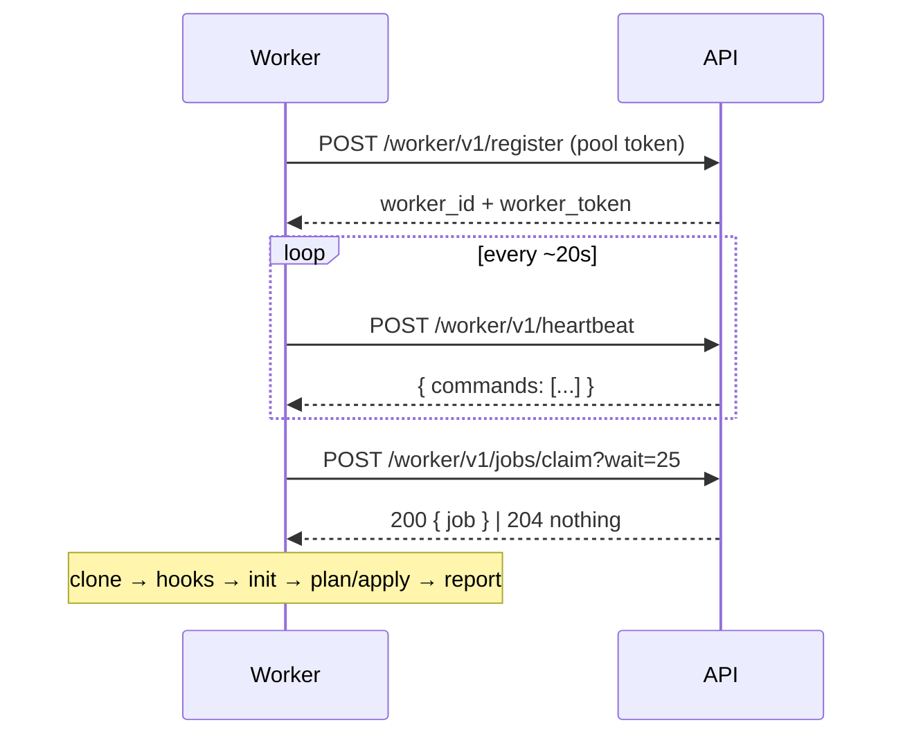

# Workers & scaling

Workers are the agents that actually run Terraform/OpenTofu. They are **self-hosted, stateless and disposable**: they **pull** work from the API and run each job in an ephemeral workspace. The API is the single source of truth; workers hold no durable state and can be killed and replaced at any time.

This page covers how the pull model works, how to run workers, and how to scale them.

## The pull model

A worker has **no inbound ports**. The API never connects out to it. Instead the worker drives everything:

1. **Register** to a pool with the pool token → it gets a `worker_id` and a per-worker token. The token expires (default 24h); the worker re-registers automatically on a `401` to refresh it.
2. **Heartbeat** every ~20s. The heartbeat response is the only *downward* channel (e.g. diagnostics, and later `cancel_job`).
3. **Claim** a job via long-poll (`POST /worker/v1/jobs/claim?wait=25`), returning `204` when there is nothing to do.
4. **Run** the job: clone the repo, run hooks + `init`/`plan`/`apply` (or the command), stream logs, report results and upload artifacts — including the saved plan the apply will use.
5. Clean up the workspace and repeat.


```mermaid
sequenceDiagram
    participant W as Worker
    participant A as API
    W->>A: POST /worker/v1/register (pool token)
    A-->>W: worker_id + worker_token
    loop every ~20s
        W->>A: POST /worker/v1/heartbeat
        A-->>W: { commands: [...] }
    end
    W->>A: POST /worker/v1/jobs/claim?wait=25
    A-->>W: 200 { job } | 204 nothing
    Note over W: clone → hooks → init → plan/apply → report
```

The **queue is Postgres**, not a broker. A claim is an atomic `SELECT … FOR UPDATE … SKIP LOCKED` that picks the next eligible run. There is no Redis, no RabbitMQ, nothing to operate beyond the database.

### One active run per environment

`SKIP LOCKED` alone does not serialise two workers claiming two *distinct* queued runs of the **same** environment. The hard guarantee is the partial unique index `one_active_run_per_env`: the second claim violates it (SQLSTATE `23505`), is caught, and is treated as "nothing to claim" — that worker simply re-polls. The claim also locks the environment row (`FOR UPDATE OF environment`) so losers skip it and pick other work instead of wasting effort.

The practical consequence: **the unit of parallelism is the environment.** Two environments of the same stack run in parallel; two runs on the same environment never do.

### Apply affinity

After a plan is confirmed, the originating worker is **preferred** for the apply for ~60s (`STACKD_APPLY_AFFINITY_SECONDS`). Past that delay (a dead or saturated worker), any compatible worker takes it. No workspace is reused either way: the apply worker clones the run's **pinned commit**, downloads the **saved plan** from the API and runs `tofu apply plan.tfplan`. It never re-plans: without a usable saved plan the run fails, and you trigger a new plan. See [Runs & approvals](runs-and-approvals.md#what-gets-applied-is-what-was-reviewed).

### Worker loss

A worker silent for > 60s is marked `offline`. The scheduler (every 10 s) then fails the runs whose job is **executing** on that worker — `preparing`, `planning`, `checking`, `running` (a command) or `applying` — as `failed (worker_lost)`, once the worker has been silent for > 120s. No human action required.

Runs that are **not executing** are never reclaimed: an `unconfirmed` run waits for a human and a `confirmed` one for the apply claim, and neither depends on the plan worker. Losing the worker that planned a run doesn't fail it; another worker applies the saved plan.

A job holding **apply credentials** — an `applying` run, or a **mutating command** run (`import`, `state rm`/`mv`, `taint`, `untaint`, `refresh`) — is the exception: it is reclaimed only after the **apply window**, the apply budget plus a grace period (`stackd_apply_timeout_seconds` + `stackd_apply_lost_grace_seconds`, default 15 min + 5 min). The worker hard-kills its own apply or mutating command at the budget, and that job's state token and apply OIDC token expire at the end of the window. So a healthy long apply is never failed mid-flight, and by the time the environment is handed to another run, the lost worker can no longer write its state. As a second safeguard, the state backend refuses a write or a lock from any token whose run has already ended.

### Time budgets

Each job's subprocesses run in their own process group: whatever a hook or a tofu command leaves running there is killed once it exits, and a watchdog kills the whole group past its budget. A plan, an apply or a command killed this way fails the run with an "exceeded the …s time budget" error:

| What | Budget |
|---|---|
| `apply` of the saved plan | the apply budget, `apply_timeout_seconds` in the claim (`STACKD_APPLY_TIMEOUT_SECONDS` on the API, default 900 s) |
| a command run's subcommand | the apply budget when the claim's `cred_phase` is `apply` (a mutating command); the default cap when it is `plan` (a read-only command). A missing or unknown `cred_phase` (an older API) gets the apply budget: it fails closed |
| each hook | the hook timeout, `STACKD_HOOK_TIMEOUT_SECONDS` on the worker (default 600 s). A hook past it fails by its own `on_failure` ([Hooks](hooks.md#failures-warnings-and-timeouts)) |
| anything else (`init`, `plan`, `show`, `output`) | the agent's default cap, 2 h |

The worker never decides on its own whether a command is mutating: it reads `cred_phase` from the claim. A plan fails on any exit code but 0 (no changes) and 2 (changes) — a killed plan never passes for "no changes".

## Create a pool

Workers register to a **pool**, scoped to a space (`space_id` in the request, the `default` space otherwise). The pool token is shown once at creation and stored **hashed**. There is no rotate endpoint: if a token leaks, delete the pool and create a new one.

```bash
AUTH="Authorization: Bearer $TOKEN"
POOL_TOKEN=$(curl -s -X POST localhost:8000/api/v1/worker-pools \
  -H "$AUTH" -H "Content-Type: application/json" \
  -d '{"name": "default"}' | jq -r .token)
```

## Run a worker

A worker needs only the API URL and the pool token (or `STACKD_POOL_TOKEN_FILE`, a file it re-reads until the token appears):

```bash
cd worker
STACKD_API_URL=http://localhost:8000 \
STACKD_POOL_TOKEN=$POOL_TOKEN \
  uv run python -m agent.main
```

### Worker settings

| Variable | Default | What it does |
|---|---|---|
| `STACKD_API_URL` | `http://api:8000` | where the worker reaches the API |
| `STACKD_POOL_TOKEN` / `STACKD_POOL_TOKEN_FILE` | — | the pool token, or a file holding it |
| `STACKD_WORKER_NAME` | the host name | the worker's name in the UI |
| `STACKD_MAX_CONCURRENT_JOBS` | `1` | jobs run at once, always on different environments |
| `STACKD_HOOK_TIMEOUT_SECONDS` | `600` | each hook's time budget |
| `STACKD_LEAK_TRIPWIRE` | `warn` | `fail` fails a plan whose non-sensitive output shows a secret |
| `STACKD_WORKSPACE_ROOT` | `/tmp/stackd-ws` | where each job's workspace is created, then removed |
| `STACKD_HEARTBEAT_INTERVAL`, `STACKD_POLL_WAIT` | `20`, `25` (s) | heartbeat period, claim long-poll |

These `STACKD_*` settings are the agent's own: **they never reach tofu or a hook**, so repo code
can't read the pool token from its environment.

!!! warning "Keep platform secrets out of the worker's environment"
    The worker needs no database, S3 or signing credential: it reaches states and saved plans through the API. tofu and platform hooks inherit the worker's environment — minus the `STACKD_*` namespace — and repo code runs inside tofu (`data "external"`, provisioners). So never give the worker `DATABASE_URL`, `S3_*` keys or `GOOGLE_CLIENT_SECRET`, nor `STACKD_ENCRYPTION_KEY` or `STACKD_JWT_SECRET`. The dev compose file blanks them for the worker. Repo hooks get only an allowlist (`PATH`, `HOME`, locale, proxy and CA settings), see [Hooks](hooks.md#what-hooks-can-see).

### Runners

Every job runs in its own workspace, removed when the job ends. Today the agent runs each tofu and hook command as a **local subprocess**, as its own OS user — whatever `STACKD_RUNNER` says. A **container runner** (`STACKD_RUNNER=docker`: each job in its own container from a runner image, see `deploy/images/`) is specified but **not implemented yet**. Until it exists, a job is isolated neither from the agent's own process nor from the other jobs of its worker: keep `STACKD_MAX_CONCURRENT_JOBS=1` on workers that run code you don't fully trust.

!!! warning "Fargate caveat, for the container runner"
    A container runner needs to launch containers, i.e. Docker-in-Docker. **AWS Fargate does not allow this.** On Fargate, the worker runs commands locally, as it does today.

## Dedicate a pool with labels

Labels route work to pools. A run is eligible for a worker only when `env.labels <@ worker.labels` (the environment's labels are a subset of the worker's). To dedicate a pool to production, label both the prod environments and a prod-only worker pool with `tier: prod`, and give general workers no such label — they will never pick up prod runs.

```yaml
# environment
labels: { tier: prod }
# prod worker pool / workers
labels: { tier: prod }
```

This is the recommended isolation for sensitive environments: combine it with prod-scoped [cloud credentials](cloud-credentials.md) for a hardened apply path.

## Scale

**Scaling = run more workers.** They are stateless, so just increase the replica count — e.g. an ECS service `desiredCount`, a Deployment `replicas`, or more agent processes. Nothing to coordinate; they all long-poll the same queue.

Because the environment is the unit of parallelism, **throughput ≈ min(workers, environments with queued work)**. Adding workers beyond the number of environments that currently have queued runs buys nothing; they will idle on `204`.

There is **no built-in autoscaler**, but the signals you need are exposed:

- `GET /api/v1/health` — DB, workers (online/total + last heartbeat), runs active/queued, recent errors.
- `GET /api/v1/queue` — waiting runs and *why* they wait (`active_run` | `env_locked` | `no_compatible_worker` | `apply_affinity_hold`).

A `no_compatible_worker` backlog means a label mismatch, not a capacity problem — adding generic workers will not help; you need workers carrying the right labels. See [Observability](observability.md) for the Workers & health page.

## See also

- [Cloud credentials](cloud-credentials.md)
- [Observability](observability.md)
- [SPECS — worker protocol (§7)](../SPECS.md)
